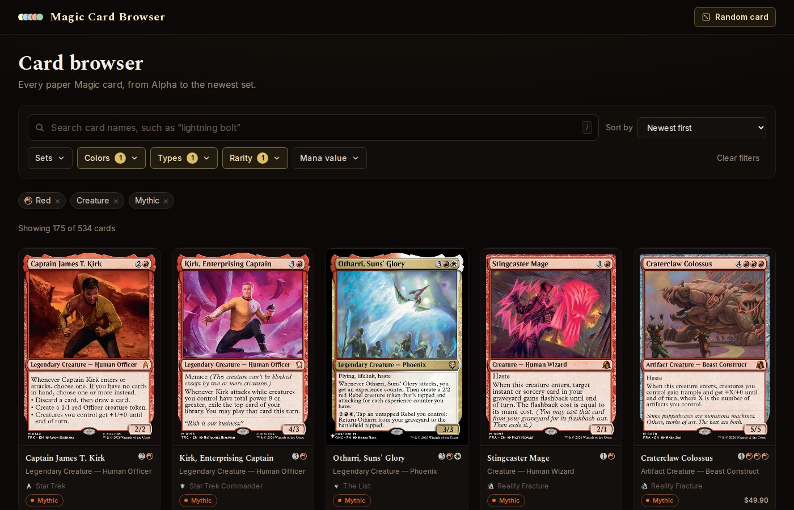
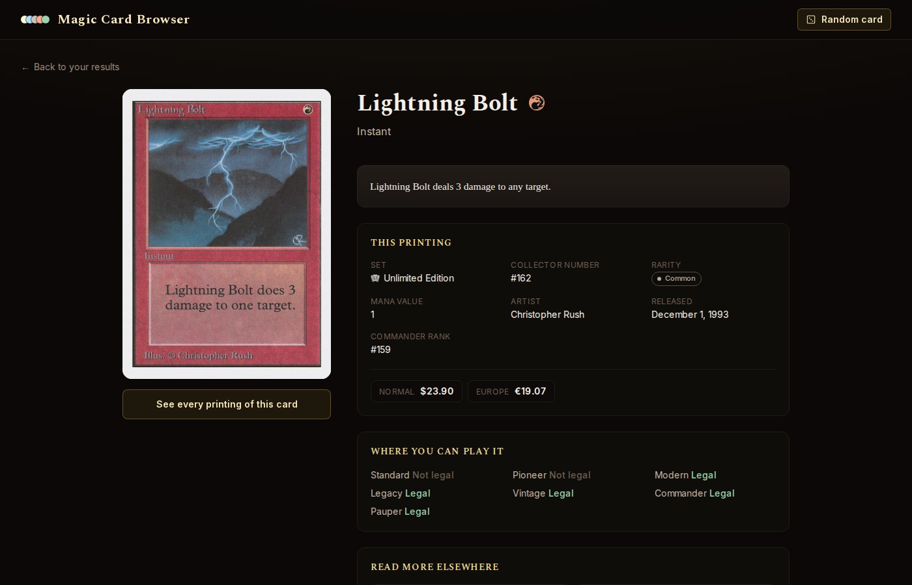
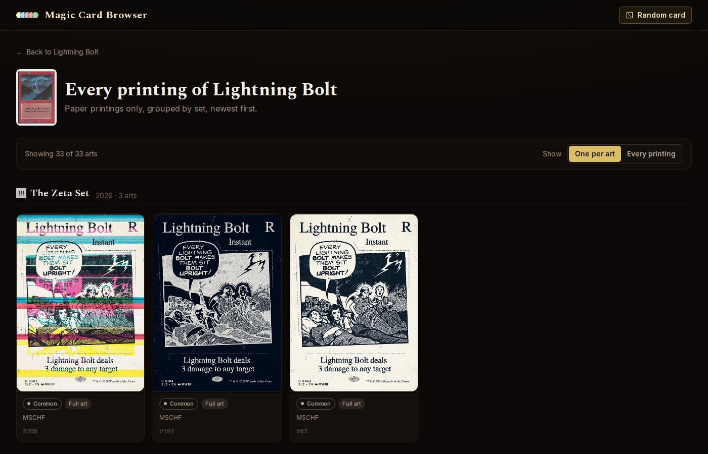

<div align="center">

# Magic Card Browser

**Search every paper Magic: The Gathering card, and see every way it was printed.**

[Open the app](https://magic-gallery.vercel.app/) · [Report a problem](https://github.com/phillram/magic-gallery/issues)



</div>

## What it does

Search for a card by name, or narrow the full list by set, color, type, rarity, and
mana value. The results change as you go. Your filters stay in the address, so a search
you build is a link you can send, and the back button returns you to the last one.

Open a card to read its rules text and flavor text, and to see its mana cost, its
prices, the formats it is legal in, and links out to Scryfall, Gatherer, TCGplayer,
EDHREC, and Archidekt. One more click shows every paper printing of that card, grouped
by set. That page opens with one printing for each piece of art, and a switch brings in
the reprints.

Card data comes from the [Scryfall API](https://scryfall.com/docs/api). The app needs no
account, no key, and no configuration.

<div align="center">


</div>

## Run it

You need Node.js 24. The repo holds that version in `.nvmrc`.

```bash
git clone https://github.com/phillram/magic-gallery.git
cd magic-gallery
npm install
npm run dev
```

The app starts on <http://localhost:3000>.

Use `npm run build` for a production build and `npm start` to serve one. `npm run lint`
and `npm run typecheck` check the code.

## How it is built

Next.js with the App Router, React, TypeScript, and Tailwind CSS. There is no database
and no server of our own: each page calls Scryfall, either from the server while it
renders or from the browser while you filter.

```text
app/         The three routes: the browser, a card, and that card's printings
components/  The interface: the filter bar, the grids, the card detail, the symbols
lib/         Scryfall calls, types, URL filter helpers, and print grouping
```

---

*Unofficial fan content. Magic: The Gathering is a trademark of Wizards of the Coast.*
